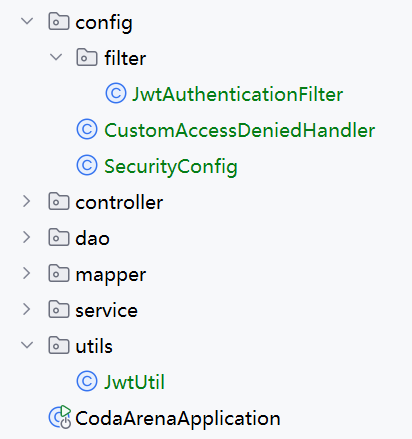
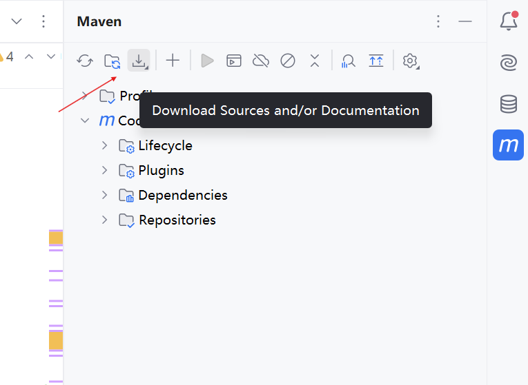
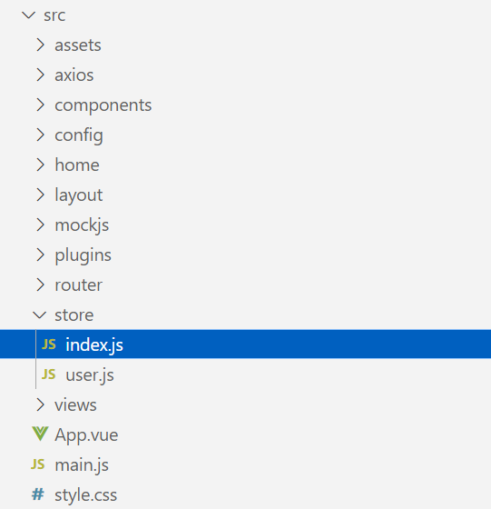
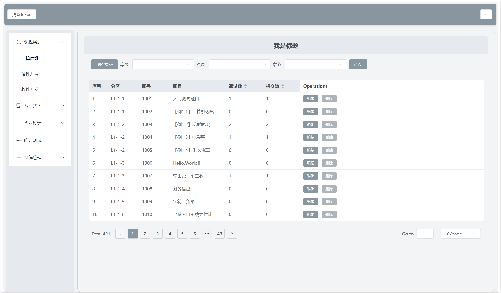
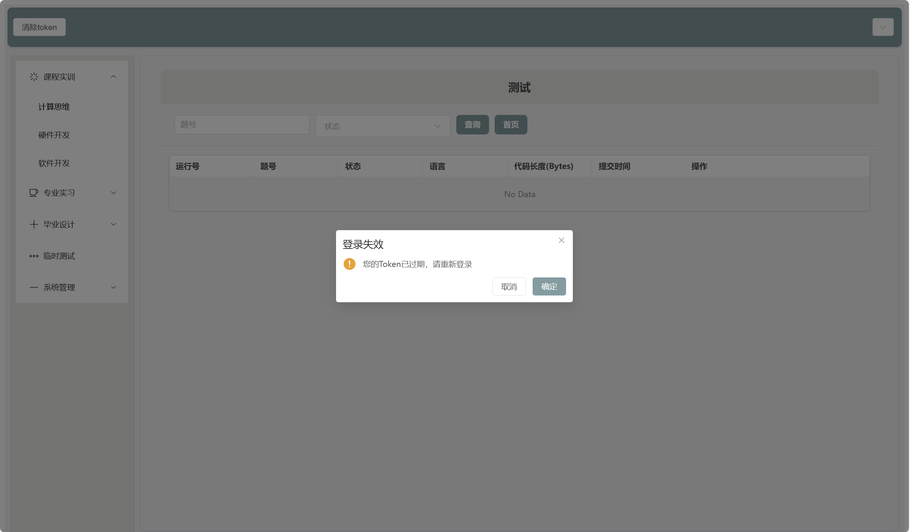
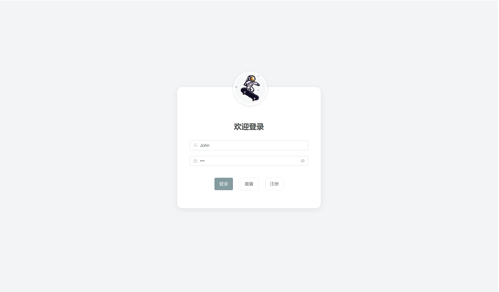

[toc]

# 在 Vue 项目中集成 Editor.md

## 简介

Editor.md 是一个功能强大的开源 Markdown 编辑器，支持实时预览、语法高亮、任务列表、公式渲染、图表支持等丰富特性，非常适合用于博客编辑器或在线文档编辑器。

本文档将指导你如何在 Vue 项目中集成 Editor.md，并实现一个基本的 Markdown 编辑器组件。

## 环境准备

### 1. 下载 Editor.md

从 [Editor.md 官方 GitHub 仓库](https://github.com/pandao/editor.md/archive/master.zip) 下载源码，或者通过以下命令直接克隆：

```bash
git clone https://github.com/pandao/editor.md.git
```

将源码放入项目的 `public` 文件夹下，例如 `public/editor.md-master/`。

### 2. 安装依赖

确保 Vue 项目已经初始化，并安装必要依赖：

```bash
npm install vue@next --save
npm install jquery --save
```

## 代码实现

### 文件结构如下


### 1. 配置 Editor 插件

在项目 `src/plugins/` 目录下创建 `editor.js` 文件，用于封装 Editor 的初始化逻辑：

```javascript
import $ from "jquery";

export const EditorConfig = {
  // Editor.md 文件的根路径
  BASE_PATH: "/editor.md-master",

  // 所需依赖的文件路径
  DEPENDENCIES: {
    marked: "/editor.md-master/lib/marked.min.js", // Markdown 解析库
    prettify: "/editor.md-master/lib/prettify.min.js", // 代码高亮库
    editormd: "/editor.md-master/editormd.min.js", // 核心编辑器文件
    css: "/editor.md-master/css/editormd.min.css", // 编辑器样式文件
  },

  // 编辑器的默认配置
  DEFAULT_OPTIONS: {
    width: "100%", // 编辑器宽度
    height: "400px", // 编辑器高度
    saveHTMLToTextarea: true, // 将 HTML 内容保存到隐藏的 textarea 中
    emoji: true, // 支持 Emoji 表情
    taskList: true, // 支持任务列表
    tex: true, // 支持 LaTeX 公式渲染
    tocm: true, // 自动生成目录
    imageUpload: true, // 支持图片上传
    imageFormats: ["jpg", "jpeg", "gif", "png", "bmp", "webp"], // 支持的图片格式
    imageUploadURL: "/api/upload/image", // 图片上传接口地址
  },
};

function loadScript(src) {
  return new Promise((resolve, reject) => {
    if (document.querySelector(`script[src="${src}"]`)) {
      resolve();
      return;
    }
    const script = document.createElement("script");
    script.src = src;
    script.onload = resolve;
    script.onerror = reject;
    document.head.appendChild(script);
  });
}

function loadStyle(href) {
  if (document.querySelector(`link[href="${href}"]`)) return;
  const link = document.createElement("link");
  link.rel = "stylesheet";
  link.href = href;
  document.head.appendChild(link);
}

async function initEditor(editorId, customOptions = {}) {
  loadStyle(EditorConfig.DEPENDENCIES.css);

  try {
    await Promise.all([
      loadScript(EditorConfig.DEPENDENCIES.marked),
      loadScript(EditorConfig.DEPENDENCIES.prettify),
      loadScript(EditorConfig.DEPENDENCIES.editormd),
    ]);

    const options = {
      ...EditorConfig.DEFAULT_OPTIONS,
      path: `${EditorConfig.BASE_PATH}/lib/`,
      ...customOptions,
    };

    return window.editormd(editorId, options);
  } catch (error) {
    console.error("Failed to initialize editor:", error);
    throw error;
  }
}

// Vue 插件
const EditorPlugin = {
  install(app) {
    // 注入 jQuery
    window.jQuery = $;
    window.$ = $;
    
    // 提供全局属性
    app.config.globalProperties.$initEditor = initEditor;
    
    // 提供全局配置访问
    app.config.globalProperties.$editorConfig = EditorConfig;
  }
};

export default EditorPlugin;
```

### 3. 注册插件

在`main.js`中进行注册`EditorPlugin`

```javascript
import EditorPlugin from './plugins/editor.js'

const app = createApp(App)
	.use(store)
	.use(router)
	.use(EditorPlugin);

window.app = app;

app.mount('#app');
```


### 4. 创建 Editor 组件

在 `src/components/` 目录下创建 `Editor.vue` 文件：

```vue
<template>
  <div :id="editorId"></div>
</template>

<script>
import { onMounted, ref, watch } from "vue";
import { initEditor } from "@/plugins/editor.js";

export default {
  name: "Editor",
  props: {
    modelValue: {
      type: String,
      default: "",
    },
    editorOptions: {
      type: Object,
      default: () => ({}),
    },
    editorId: {
        type: String,
        default: "editorId",
    }
  },
  setup(props, { emit }) {
        const editorId = ref(`${props.editorId}`);
        let editorInstance = null;

        const initEditor = async () => {
            try {
                const { $initEditor, $editorConfig } = window.app.config.globalProperties;
                editorInstance = await $initEditor(editorId.value, {
                    ...$editorConfig.DEFAULT_OPTIONS,
                    ...props.editorOptions,
                    onload: function () {
                        // 同步初始内容
                        this.setMarkdown(props.modelValue || "");
                    },
                    onchange: function () {
                        // 更新父组件的响应式数据
                        emit("update:modelValue", this.getMarkdown());
                    },
                });
            } catch (error) {
                console.error("Editor initialization failed:", error);
            }
        };

        onMounted(() => {
            initEditor();
        });

        watch(
            () => props.modelValue,
            (newVal) => {
                if (editorInstance && newVal !== editorInstance.getMarkdown()) {
                    editorInstance.setMarkdown(newVal);
                }
            }
        );

        return {
            editorId,
        };
    },
};
</script>

<style scoped>

</style>
```

### 3. 使用 Editor 组件

在页面组件中引入 `Editor`，例如 `HomeEdit.vue`：

```vue
<template>
  <div>
    <Editor v-model="content" :editor-options="editorOptions" />
    <button @click="saveContent">Save</button>
  </div>
</template>

<script>
import { ref } from "vue";
import Editor from "@/components/Editor.vue";

// 将响应式变量content绑定给Editor组件
const content = ref('');
    
</script>
```

## 总结

通过以上步骤，你可以在 Vue 项目中成功集成 Editor.md，并将其封装为一个灵活的可复用组件。你可以根据需求进一步自定义样式和功能，例如添加更多主题、优化图片上传逻辑等。

**结果如图**


# 在项目中集成 JWT（JSON Web Token）

## 简介

JWT（JSON Web Token）是一种紧凑且安全的令牌格式，用于在应用的不同部分之间传递认证信息。JWT 通常用于用户登录认证，并在后续请求中验证用户身份。

本文将介绍如何在项目中使用 JWT，包括生成令牌、解析令牌以及在客户端和服务端集成的详细过程。

---

## 基本概念

### 1. JWT 的结构

JWT 由三部分组成，每部分通过 `.` 分隔：

```
header.payload.signature
```

- **Header（头部）**：定义令牌的元信息，如算法类型。

	```json
	{
	  "alg": "HS256",
	  "typ": "JWT"
	}
	```

- **Payload（载荷）**：存储用户相关信息，通常是 JSON 对象。

	```json
	{
	  "sub": "1234567890",
	  "name": "John Doe",
	  "iat": 1516239022
	}
	```

- **Signature（签名）**：用于验证令牌是否被篡改。计算方法：

	```
	HMACSHA256(
	  base64UrlEncode(header) + "." + base64UrlEncode(payload),
	  secret
	)
	```

### 2. JWT 的特点

- **自包含性**：令牌中存储了所有需要的信息。
- **安全性**：通过签名确保数据的完整性。
- **跨语言支持**：JWT 是标准协议，可以在不同语言中使用。

---

## 服务端实现

文件结构如下：



### 1. 安装依赖

以 SpringBoot 项目为例，使用 `jsonwebtoken` 库来生成和验证令牌，在pom.xml中引入依赖：

```xml
<dependency>
    <groupId>io.jsonwebtoken</groupId>
    <artifactId>jjwt-api</artifactId>
    <version>0.11.5</version>
</dependency>
<dependency>
    <groupId>io.jsonwebtoken</groupId>
    <artifactId>jjwt-impl</artifactId>
    <version>0.11.5</version>
    <scope>runtime</scope>
</dependency>
<dependency>
    <groupId>io.jsonwebtoken</groupId>
    <artifactId>jjwt-jackson</artifactId>
    <version>0.11.5</version>
    <scope>runtime</scope>
</dependency>
```

使用Maven下载依赖点击如下：



### 2. 生成 JWT

在服务端创建一个生成 JWT 的对象在`utils\JwtUtil`：

```java
package com.xyz.codearena.utils;

import io.jsonwebtoken.Claims;
import io.jsonwebtoken.Jwts;
import io.jsonwebtoken.SignatureAlgorithm;
import org.springframework.security.core.userdetails.UserDetails;
import org.springframework.stereotype.Component;

import javax.crypto.SecretKey;
import javax.crypto.spec.SecretKeySpec;
import java.util.Base64;
import java.util.Date;
import java.util.UUID;

@Component
public class JwtUtil {

    // 目前 6s
    public static final long JWT_TTL = 1000 * 60 * 60 * 24 * 14 ;  // 有效期14天
    public static final String JWT_KEY = "JSDFSDFSDFASJDHASDASDdfa32dJHASFDA67765asda123";//密钥
    public static String getUUID() {
        return UUID.randomUUID().toString().replaceAll("-", "");
    }

    //Base64编码密钥
    public static SecretKey generalKey() {
        byte[] encodeKey = Base64.getDecoder().decode(JwtUtil.JWT_KEY);
        return new SecretKeySpec(encodeKey, 0, encodeKey.length, "HmacSHA256");
    }

    // 生成 JWT Token
    public static String createJwt(String username,String role) {
        //密钥
        SecretKey secretKey = generalKey();

        //开始时间（被签发的时间）
        long nowMillis = System.currentTimeMillis();
        //持续时间
        Long ttlMillis = JwtUtil.JWT_TTL;
        //失效时间（过期时间）
        long expMillis = nowMillis + ttlMillis;

        //开始日期类型，转换类型
        Date now = new Date(nowMillis);
        //失效日期类型，转换类型
        Date expDate = new Date(expMillis);


        return Jwts.builder()
                .setId(getUUID())           //随机生成一个ID
                .setSubject(username)       //设置sub（主题）声明，即针对的用户
                .setIssuer("se")            //签发者，随便写就可以
                .setIssuedAt(now)           //token开始时间
                .setExpiration(expDate)     //token失效时间
                .claim("role", role)  //将角色添加到 Payload 中
                .signWith(SignatureAlgorithm.HS256, secretKey) //使用HS256编码格式，以及密钥进行加密
                .compact();                 //将各部分进行编码和组合
    }

    // 解析 JWT Token
    public static Claims parseJWT(String jwt)  {
        //密钥
        SecretKey secretKey = generalKey();
        return Jwts.parserBuilder()
                .setSigningKey(secretKey)
                .build()
                .parseClaimsJws(jwt)
                .getBody();
    }

    //从JWT令牌中提取过期时间
    private Date extractExpiration(String token) {
        //密钥
        SecretKey secretKey = generalKey();
        return Jwts.parser()
                .setSigningKey(secretKey)  // 使用密钥验证JWT的签名
                .parseClaimsJws(token)  // 解析JWT
                .getBody()  // 获取JWT的主体部分
                .getExpiration();  // 返回JWT的过期时间
    }

    //检查JWT是否已经过期
    public boolean isTokenExpired(String token) {
        return extractExpiration(token).before(new Date());
    }


    //从JWT令牌中提取出用户名
    public String extractUsername(String token) {
        //密钥
        SecretKey secretKey = generalKey();
        return Jwts.parser()
                .setSigningKey(secretKey)  // 设置密钥进行验证
                .parseClaimsJws(token)  // 解析JWT
                .getBody()  // 获取JWT的主体部分
                .getSubject();  // 返回主体部分中的“subject”（用户名）
    }

    //验证JWT是否有效
    public boolean validateToken(String token, UserDetails userDetails) {
        String username = extractUsername(token);  // 提取JWT中的用户名
        return (username.equals(userDetails.getUsername()) && !isTokenExpired(token));  // 判断用户名是否一致且令牌没有过期
    }
}

```

### 3. 设置过滤器JwtAuthenticationFilter

用于拦截 HTTP 请求，检查请求头中的 JWT，并根据 JWT 内容进行身份认证：

```java
package com.xyz.codearena.config.filter;

import com.fasterxml.jackson.databind.ObjectMapper;
import com.xyz.codearena.utils.JwtUtil;
import io.jsonwebtoken.Claims;
import io.jsonwebtoken.ExpiredJwtException;
import jakarta.servlet.FilterChain;
import jakarta.servlet.ServletException;
import jakarta.servlet.http.HttpServletRequest;
import jakarta.servlet.http.HttpServletResponse;
import org.springframework.beans.factory.annotation.Autowired;
import org.springframework.security.authentication.UsernamePasswordAuthenticationToken;
import org.springframework.security.core.GrantedAuthority;
import org.springframework.security.core.authority.SimpleGrantedAuthority;
import org.springframework.security.core.context.SecurityContextHolder;
import org.springframework.stereotype.Component;
import org.springframework.util.StringUtils;
import org.springframework.web.filter.OncePerRequestFilter;

import java.io.IOException;
import java.util.ArrayList;
import java.util.HashMap;
import java.util.List;
import java.util.Map;

@Component
public class JwtAuthenticationFilter extends OncePerRequestFilter {

    @Autowired
    private JwtUtil jwtUtil;

    @Override
    protected void doFilterInternal(HttpServletRequest request, HttpServletResponse response, FilterChain filterChain)
            throws ServletException, IOException {

        String token = getJwtFromRequest(request);

        if (StringUtils.hasText(token)) {
            try {
                // 解析JWT
                Claims claims = jwtUtil.parseJWT(token);

                //检查token是否过期
                if (claims != null && !jwtUtil.isTokenExpired(token)) {

                    // 提取用户名
                    String username = claims.getSubject();
                    // 提取角色权限
                    String role = claims.get("role", String.class);
                    // 将角色权限加入 GrantedAuthority 的列表
                    List<GrantedAuthority> authorities = new ArrayList<>();
                    authorities.add(new SimpleGrantedAuthority("ROLE_" + role));
                    // 认证信息
                    UsernamePasswordAuthenticationToken authentication =
                            new UsernamePasswordAuthenticationToken(username, null, authorities);
                    // 将认证信息存储到SecurityContext中
                    SecurityContextHolder.getContext().setAuthentication(authentication);
                }

            } catch (ExpiredJwtException e) {
                // 捕获 JWT 过期异常，并返回自定义消息
                sendCustomData(response, 401,"您的Token已过期，请重新登录", 200);
                return;
            }catch (Exception e) {
                // 捕获其他异常，返回自定义消息
                sendCustomData(response, 400,"无效的 Token", 200);
                return;
            }
        }

        //将请求继续传递给后续的过滤器
        //在过滤器链中调用下一个过滤器或请求处理器的关键方法
        filterChain.doFilter(request, response);
    }


    //从 HTTP 请求的 Authorization 头部中提取出 JWT
    private String getJwtFromRequest(HttpServletRequest request) {
        //获取请求头中的 Authorization 字段
        String bearerToken = request.getHeader("Authorization");
        //检查 Authorization 头部是否包含 Bearer 前缀，如果有 Bearer 前缀，去掉它并返回 JWT 字符串；如果没有，返回 null
        if (StringUtils.hasText(bearerToken) && bearerToken.startsWith("Bearer ")) {
            return bearerToken.substring(7);
        }
        return null;
    }

    //自定义AckCode返回响应信息
    private void sendCustomData(HttpServletResponse response, int AckCode, String message, int statusCode) throws IOException {
        response.setStatus(statusCode);  // 设置 HTTP 状态码
        response.setContentType("application/json;charset=UTF-8");  // 设置响应内容类型为 JSON 且指定字符编码为 UTF-8
        response.setCharacterEncoding("UTF-8");  // 设置响应编码为 UTF-8

        // 构造自定义数据响应内容
        Map<String, Object> res = new HashMap<>();
        res.put("msg", message);  // 消息提示
        res.put("code", AckCode );  // 返回码

        // 使用 Jackson 将 Map 转换为 JSON 字符串
        String jsonResponse = new ObjectMapper().writeValueAsString(res);

        // 输出响应内容
        response.getWriter().write(jsonResponse);
    }
}
```

### 4.设置自定义权限不足配置

使用`CustonAccessDeniedHandler`处理方法，自定义权限不足时进行的处理。启用之后，如果发送请求没有对应权限，会和之前token失效一样返回异常状态码，使用自定义一个处理器用于处理异常，将状态码设置为200，不返回错误，而是返回自定义的响应信息。

```java
package com.xyz.codearena.config;

import jakarta.servlet.ServletException;
import jakarta.servlet.http.HttpServletRequest;
import jakarta.servlet.http.HttpServletResponse;
import org.springframework.security.access.AccessDeniedException;
import org.springframework.security.web.access.AccessDeniedHandler;
import org.springframework.stereotype.Component;

import java.io.IOException;

@Component
public class CustomAccessDeniedHandler implements AccessDeniedHandler {
    @Override
    public void handle(HttpServletRequest request, HttpServletResponse response, AccessDeniedException accessDeniedException)
            throws IOException, ServletException {
        response.setStatus(200);
        response.setContentType("application/json;charset=UTF-8");
        response.getWriter().write("{\"msg\": \"您的用户没有该权限\", \"code\": 403}");
    }
}
```

### 5.配置Config文件

在`config\SecurityConfig.java`文件，用来配置和管理 **安全过滤器链**（Security Filter Chain）的核心组件。它定义了如何配置过滤器，控制请求的安全性，定义 HTTP 请求的访问规则（如：哪些请求需要认证，哪些请求不需要认证，如何配置不同的权限等）。

```java
package com.xyz.codearena.config;

import com.xyz.codearena.config.filter.JwtAuthenticationFilter;
import org.springframework.context.annotation.Bean;
import org.springframework.context.annotation.Configuration;
import org.springframework.security.config.annotation.method.configuration.EnableGlobalMethodSecurity;
import org.springframework.security.config.annotation.web.builders.HttpSecurity;
import org.springframework.security.config.annotation.web.configuration.EnableWebSecurity;
import org.springframework.security.crypto.bcrypt.BCryptPasswordEncoder;
import org.springframework.security.crypto.password.PasswordEncoder;
import org.springframework.security.web.SecurityFilterChain;
import org.springframework.security.web.authentication.UsernamePasswordAuthenticationFilter;

@Configuration
@EnableWebSecurity
@EnableGlobalMethodSecurity(prePostEnabled = true, securedEnabled = true)  // 启用方法级安全，@PreAuthorize 或 @Secured 注解生效
public class SecurityConfig {

    private final JwtAuthenticationFilter jwtAuthenticationFilter;
    //权限不足处理
    private final CustomAccessDeniedHandler customAccessDeniedHandler;

    public SecurityConfig(JwtAuthenticationFilter jwtAuthenticationFilter, CustomAccessDeniedHandler customAccessDeniedHandler) {
        this.jwtAuthenticationFilter = jwtAuthenticationFilter;
        this.customAccessDeniedHandler = customAccessDeniedHandler;
    }

    @Bean
    public SecurityFilterChain securityFilterChain(HttpSecurity http) throws Exception {
        http
                .csrf(csrf -> csrf.disable())  // 关闭 CSRF，适用于前后端分离项目
                .authorizeHttpRequests(auth -> auth
                        .requestMatchers("/login").permitAll()  // 登录接口允许匿名访问
                        .anyRequest().authenticated()// 其他请求需要认证
                )
                .exceptionHandling(exceptionHandling ->
                        exceptionHandling.accessDeniedHandler(customAccessDeniedHandler)  // 自定义权限不足处理
                )
                .addFilterBefore(jwtAuthenticationFilter, UsernamePasswordAuthenticationFilter.class); //添加JWT过滤器

        return http.build();
    }

    @Bean
    public PasswordEncoder passwordEncoder() {
        return new BCryptPasswordEncoder();
    }
}
```

---

## 客户端实现

### 1. 存储令牌

客户端通常将令牌存储在以下位置：

- **`localStorage`**：适合长期存储。
- **`sessionStorage`**：适合会话级存储。
- **Cookie**：适合与服务端通信，支持 HttpOnly。

```javascript
// 存储令牌
localStorage.setItem('token', token);

// 获取令牌
const token = localStorage.getItem('token');
```

在这里我们使用`localstorage`进行配置文件包含`index.js`和`user.js`文件结构如下：



配置`src\store\index.js`如下:

```javascript
import { createStore } from "vuex";
import User from './user.js'

export default createStore({
    state:{},
    getters:{},
    mutations:{},
    actions:{},
    modules:{User }
});
```

配置`src\store\user.js`如下:

```javascript
export default {
    namespaced: true,
    // 这些数据在网页刷新后就清空
    // 网页加载后重新实例化 App ，故生成新的实例对象
    state:{
        token:'',
        userInfor:{
            username:''
        }
    },
    getters: {
        getToken(state) {
            return state.token;
        },
        getUserName(state) {
            if(!! localStorage.getItem('Username')) return localStorage.getItem('Username');
            else return state.userInfor.username;
        },
        isLogin(state) {
            return !! state.token || !! localStorage.getItem('myvue_login_token');
        },
    },
    mutations: {
        setToken(state, token){
            localStorage.setItem('myvue_login_token', token);
            state.token = token;
            console.log("setToken:" + state.token);
        },
        setUserName(state, username) {
            localStorage.setItem('Username', username);
            state.userInfor.username = username;
        },
        clearToken(state){
            localStorage.removeItem('myvue_login_token');
            state.token = '';
        }
    },

    actions: {},
    modules: {}
}
```

### 2. 在请求中携带令牌

在`src\axios\instance.js`配置相关请求拦截器，在请求发送后自动添加上相关的HTTP请求头，通过 HTTP 请求头传递令牌，通常使用 `Authorization` 头：

```javascript
const instance = axios.create({ ...baseConfig });
// 设置请求拦截器
instance.interceptors.request.use(
    (config) => {
        let token = localStorage.getItem('myvue_login_token');
        if (token) {
            config.headers['Authorization'] = `Bearer ${token}`;
        } else router.push({ name: 'LoginView' });
        return config;
    },
    (error) => {
        return Promise.reject(error);
    }
);
```

### 3.在响应中处理令牌

同样在`instance.js`文件中设置响应拦截器，对其中返回状态码进行判断，如果没有token授权了就直接返回至*Login*页面

```javascript
// 设置响应拦截器
instance.interceptors.response.use(
    (response) => {
        if ((200 <= response.data.code && response.data.code < 400) || response.data.code === -2) {
            return response.data; // 用户名或密码错误，返回登陆页面
        }
        else if (response.data.code === -1) router.push('/login');
        else if(response.data.code === 401) {
            console.log(store === undefined);
            store.commit('User/clearToken');
            // 弹出提示框
            ElMessageBox.confirm(response.data.msg, '登录失效', {
                confirmButtonText: '确定',
                cancelButtonText: '取消',
                type: 'warning',
            }).then(() => {
                // 确认后跳转到登录页
                setTimeout(() => {
                    router.push('/login'); 
                }, 200);
            }).catch(() => {
                // 如果点击取消，也可以跳转或者做其他处理
                router.replace('/login');
            });
        } else if(response.data.code === 403) {
            //没有权限
            // 弹出提示框
            ElMessageBox.alert(response.data.msg, '权限不足', {
                confirmButtonText: '关闭',
                type: 'warning',
            });
        }
        return Promise.reject(response.data);
    },
    (error) => {
        return Promise.reject(error);
    }
);
```

---

## 安全性建议

1. **使用 HTTPS**：确保传输数据安全。
2. **设置过期时间**：令牌应设置合理的过期时间。
3. **更新秘钥**：定期更新秘钥，防止滥用。
4. **防止 XSS 攻击**：避免在不安全的地方存储令牌。
5. **使用 HttpOnly Cookie**：存储敏感令牌时，避免在客户端脚本中直接访问。

---

## 总结

通过以上步骤，您可以在项目中成功集成 JWT，完成用户认证和授权。JWT 是一种灵活且高效的认证方式，但需要注意安全问题，确保数据传输和存储的安全性。

**结果如下**

- 正常页面显示



- 当token过期后发起请求



- 返回登陆页面

