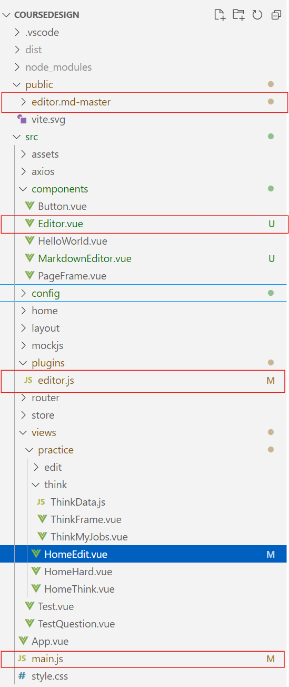
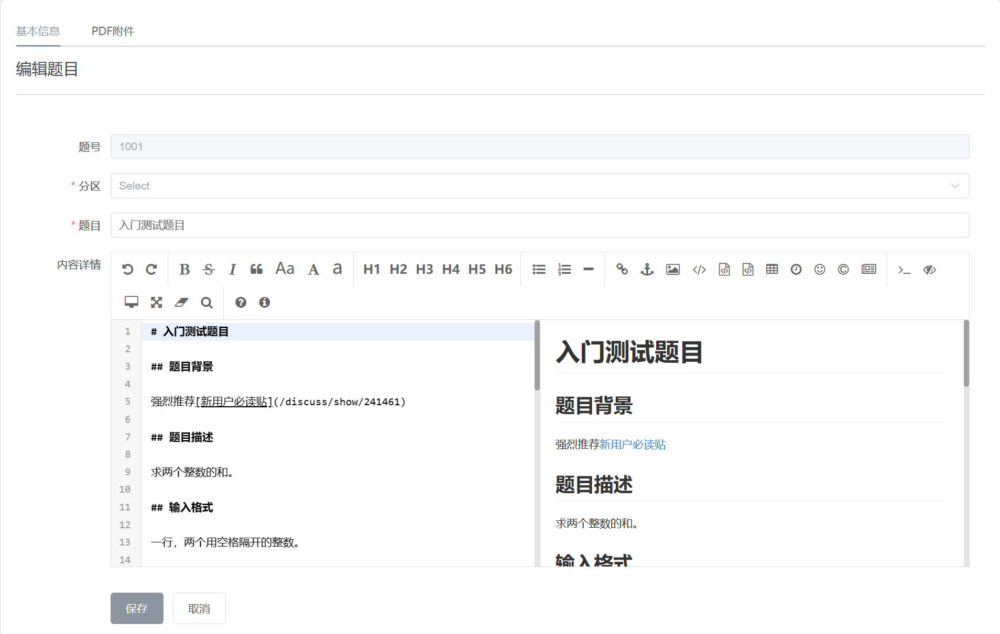

[toc]


# 在 Vue 项目中集成 Editor.md

## 简介
Editor.md 是一个功能强大的开源 Markdown 编辑器，支持实时预览、语法高亮、任务列表、公式渲染、图表支持等丰富特性，非常适合用于博客编辑器或在线文档编辑器。

本文档将指导你如何在 Vue 项目中集成 Editor.md，并实现一个基本的 Markdown 编辑器组件。

## 环境准备
### 1. 下载 Editor.md
从 [Editor.md 官方 GitHub 仓库](https://github.com/pandao/editor.md/archive/master.zip) 下载源码，或者通过以下命令直接克隆：

```bash
git clone https://github.com/pandao/editor.md.git
```

将源码放入项目的 `public` 文件夹下，例如 `public/editor.md-master/`。

### 2. 安装依赖
确保 Vue 项目已经初始化，并安装必要依赖：

```bash
npm install vue@next --save
npm install jquery --save
```

## 代码实现

### 文件结构如下



### 1. 配置 Editor 插件
在项目 `src/plugins/` 目录下创建 `editor.js` 文件，用于封装 Editor 的初始化逻辑：

```javascript
import $ from "jquery";

export const EditorConfig = {
  // Editor.md 文件的根路径
  BASE_PATH: "/editor.md-master",

  // 所需依赖的文件路径
  DEPENDENCIES: {
    marked: "/editor.md-master/lib/marked.min.js", // Markdown 解析库
    prettify: "/editor.md-master/lib/prettify.min.js", // 代码高亮库
    editormd: "/editor.md-master/editormd.min.js", // 核心编辑器文件
    css: "/editor.md-master/css/editormd.min.css", // 编辑器样式文件
  },

  // 编辑器的默认配置
  DEFAULT_OPTIONS: {
    width: "100%", // 编辑器宽度
    height: "400px", // 编辑器高度
    saveHTMLToTextarea: true, // 将 HTML 内容保存到隐藏的 textarea 中
    emoji: true, // 支持 Emoji 表情
    taskList: true, // 支持任务列表
    tex: true, // 支持 LaTeX 公式渲染
    tocm: true, // 自动生成目录
    imageUpload: true, // 支持图片上传
    imageFormats: ["jpg", "jpeg", "gif", "png", "bmp", "webp"], // 支持的图片格式
    imageUploadURL: "/api/upload/image", // 图片上传接口地址
  },
};

function loadScript(src) {
  return new Promise((resolve, reject) => {
    if (document.querySelector(`script[src="${src}"]`)) {
      resolve();
      return;
    }
    const script = document.createElement("script");
    script.src = src;
    script.onload = resolve;
    script.onerror = reject;
    document.head.appendChild(script);
  });
}

function loadStyle(href) {
  if (document.querySelector(`link[href="${href}"]`)) return;
  const link = document.createElement("link");
  link.rel = "stylesheet";
  link.href = href;
  document.head.appendChild(link);
}

async function initEditor(editorId, customOptions = {}) {
  loadStyle(EditorConfig.DEPENDENCIES.css);

  try {
    await Promise.all([
      loadScript(EditorConfig.DEPENDENCIES.marked),
      loadScript(EditorConfig.DEPENDENCIES.prettify),
      loadScript(EditorConfig.DEPENDENCIES.editormd),
    ]);

    const options = {
      ...EditorConfig.DEFAULT_OPTIONS,
      path: `${EditorConfig.BASE_PATH}/lib/`,
      ...customOptions,
    };

    return window.editormd(editorId, options);
  } catch (error) {
    console.error("Failed to initialize editor:", error);
    throw error;
  }
}

// Vue 插件
const EditorPlugin = {
  install(app) {
    // 注入 jQuery
    window.jQuery = $;
    window.$ = $;
    
    // 提供全局属性
    app.config.globalProperties.$initEditor = initEditor;
    
    // 提供全局配置访问
    app.config.globalProperties.$editorConfig = EditorConfig;
  }
};

export default EditorPlugin;
```

### 3. 注册插件

在`main.js`中进行注册`EditorPlugin`

```javascript
import EditorPlugin from './plugins/editor.js'

const app = createApp(App)
	.use(store)
	.use(router)
	.use(EditorPlugin);

window.app = app;

app.mount('#app');
```


### 4. 创建 Editor 组件

在 `src/components/` 目录下创建 `Editor.vue` 文件：

```vue
<template>
  <div :id="editorId"></div>
</template>

<script>
import { onMounted, ref, watch } from "vue";
import { initEditor } from "@/plugins/editor.js";

export default {
  name: "Editor",
  props: {
    modelValue: {
      type: String,
      default: "",
    },
    editorOptions: {
      type: Object,
      default: () => ({}),
    },
    editorId: {
        type: String,
        default: "editorId",
    }
  },
  setup(props, { emit }) {
        const editorId = ref(`${props.editorId}`);
        let editorInstance = null;

        const initEditor = async () => {
            try {
                const { $initEditor, $editorConfig } = window.app.config.globalProperties;
                editorInstance = await $initEditor(editorId.value, {
                    ...$editorConfig.DEFAULT_OPTIONS,
                    ...props.editorOptions,
                    onload: function () {
                        // 同步初始内容
                        this.setMarkdown(props.modelValue || "");
                    },
                    onchange: function () {
                        // 更新父组件的响应式数据
                        emit("update:modelValue", this.getMarkdown());
                    },
                });
            } catch (error) {
                console.error("Editor initialization failed:", error);
            }
        };

        onMounted(() => {
            initEditor();
        });

        watch(
            () => props.modelValue,
            (newVal) => {
                if (editorInstance && newVal !== editorInstance.getMarkdown()) {
                    editorInstance.setMarkdown(newVal);
                }
            }
        );

        return {
            editorId,
        };
    },
};
</script>

<style scoped>

</style>
```

### 3. 使用 Editor 组件
在页面组件中引入 `Editor`，例如 `HomeEdit.vue`：

```vue
<template>
  <div>
    <Editor v-model="content" :editor-options="editorOptions" />
    <button @click="saveContent">Save</button>
  </div>
</template>

<script>
import { ref } from "vue";
import Editor from "@/components/Editor.vue";

// 将响应式变量content绑定给Editor组件
const content = ref('');
    
</script>
```

## 总结
通过以上步骤，你可以在 Vue 项目中成功集成 Editor.md，并将其封装为一个灵活的可复用组件。你可以根据需求进一步自定义样式和功能，例如添加更多主题、优化图片上传逻辑等。

**结果如图**



