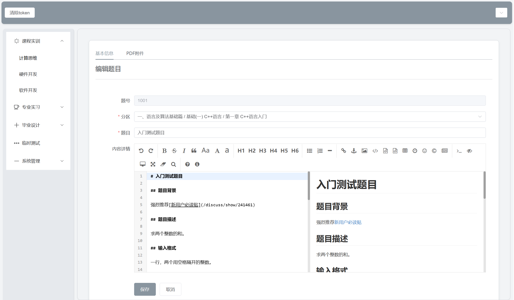
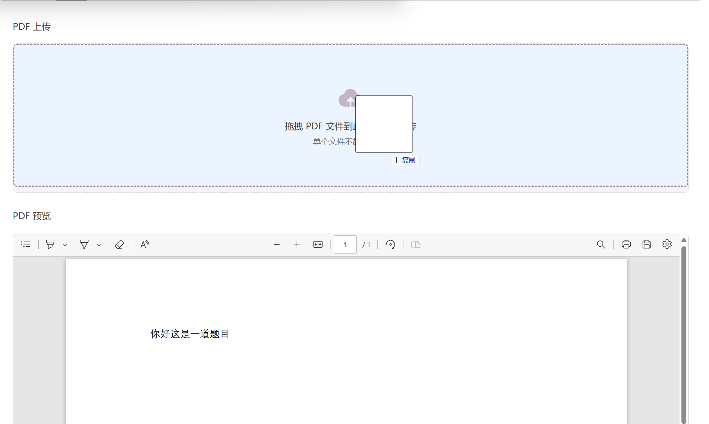
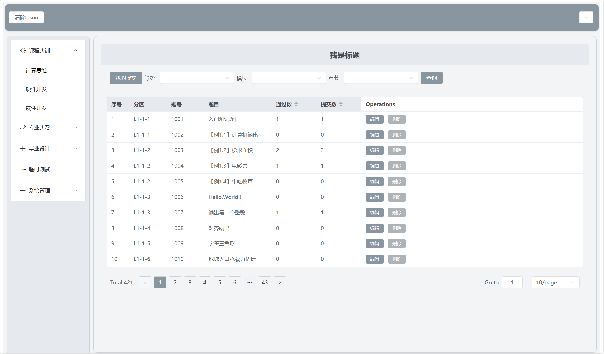
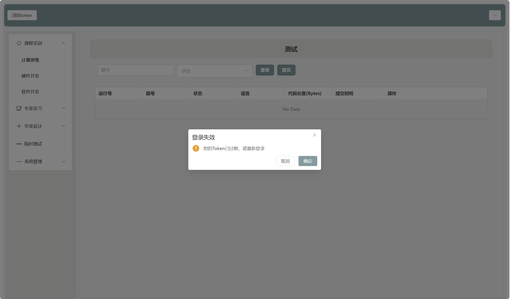
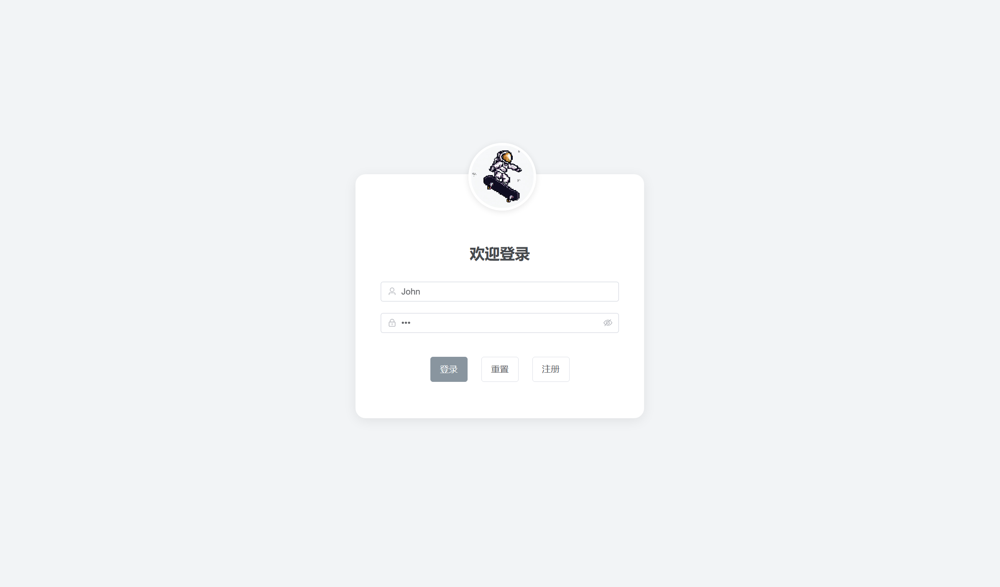

# CodeArena

> A Vue-based problem-solving management system supporting Markdown editing, PDF upload, JWT authentication, CRUD operations, theme switching, and user authentication features.

## 🚀 Features

- **Markdown Editor**
  - Implements real-time Markdown editing and preview using [Editor.md](https://pandao.github.io/editor.md/)
  - Rich toolbar support for convenient problem content authoring

- **JWT Authentication**
  - Token acquisition from backend after login for user session management
  - Automatic token expiration for enhanced security
  - Backend repository: [CodeArena-backend](https://github.com/FadingVortex/CodeArena-backend)

- **PDF Upload & Real-time Display**
  - Drag-and-drop PDF file upload with instant content preview
  - PDF-to-string conversion for database storage

- **CRUD Operations**
  - Database design centered around problems with the following basic structure:
    ```javascript
    const formData = ref({
      id: '',        // Problem ID
      LMC: '',       // Category
      title: '',     // Problem title
      content: '',   // Detailed content
      pdfString: '', // PDF content string
    });
    ```
  - Additional tables for extended data management with backup functionality

- **Theme Switching**
  - Multiple color themes available for enhanced user experience

<p align="center">   
     
     
   
   
   
</p>

## 🛠️ Tech Stack

### Frontend
- Framework: Vue 3 + Vite
- Main Dependencies:
  ```json
  "dependencies": {
    "axios": "^1.7.7",
    "editor.md": "^1.5.0",
    "element-plus": "^2.8.1",
    "jquery": "^3.7.1",
    "mockjs": "^1.1.0",
    "pdfjs-dist": "^4.10.38",
    "scriptjs": "^2.5.9",
    "vue": "^3.4.37",
    "vue-router": "^4.5.0",
    "vuex": "^4.0.2",
    "zepto": "^1.2.0"
  }
  ```
- Development Dependencies:
  ```json
  "devDependencies": {
    "@vitejs/plugin-vue": "^5.1.2",
    "unplugin-auto-import": "^0.18.2",
    "unplugin-vue-components": "^0.27.4",
    "vite": "^5.4.1"
  }
  ```

### Backend
- Framework: Spring Boot
- Database: MySQL

## 📁 Project Structure

```
CodeArena/
├── src/
│   ├── assets/
│   │   └── theme/         # Custom color themes
│   ├── axios/             # Encapsulated request modules
│   ├── components/        # Reusable components (including Editor.vue)
│   ├── plugins/           # Plugin code (e.g., editor.js)
│   ├── store/             # Vuex state management
│   ├── views/             # Page files
│   ├── router/            # Route definitions
│   └── App.vue            # Main entry component
├── public/                # Static resource folder
├── package.json           # Project dependencies and scripts
└── README.md             # Project documentation
```

## 🚦 API Endpoints

### Base Configuration
- Base URL prefix: `/hello-mycross`
- Headers: `Content-Type: application/json;charset=UTF-8`
- Timeout: 10000ms
- Credentials: Enabled
- Response Type: JSON

### Authentication
- `POST /login` - User login
  - Request body: `{ username: string, password: string }`
- `POST /register` - User registration
  - Request body: Registration information

### Problem Management
#### Query Operations
- `GET /think/query/questions` - Query problems by conditions
  - Query parameters:
    - `?id=number` - Query by ID
    - `?LMC=string` - Query by LMC code
- `POST /think/query/page/questions` - Paginated problem query
  - Request body: Pagination parameters and query conditions

#### Edit Operations
- `POST /edit/update/question` - Update problem information
- `POST /edit/add/question` - Add new problem
- `POST /think/delete/questions` - Delete problem
- `POST /api/upload/pdf` - Upload PDF file

### Submission Management
- `POST /think/jobs/query` - Query submissions
- `POST /thinkhome/jobs/delete` - Delete submissions

### System Configuration
- `GET /think/options` - Get system options
  - For module list retrieval
  - For chapter information retrieval

### Request Interceptor Features
- Automatic token authentication
- Token format: `Bearer ${token}`
- Automatic login page redirection when token is missing

### Response Interceptor Features
- Status code handling:
  - 200-399: Normal response
  - -2: Username/password error
  - -1: Redirect to login
  - 401: Login expired
  - 403: Insufficient permissions

## 🛠️ Setup and Installation

### Frontend Setup
1. Clone frontend repository:
   ```bash
   git clone https://github.com/FadingVortex/CodeArena.git
   cd CodeArena
   ```

2. Install dependencies:
   ```bash
   npm install
   ```

3. Start development server:
   ```bash
   npm run dev
   ```

### Backend Setup
1. Clone backend repository:
   ```bash
   git clone https://github.com/FadingVortex/CodeArena-backend.git
   ```

2. Configure database connection:
   - Modify database configuration in `application.yml`

3. Start backend service:
   - Run Spring Boot project using IDE (e.g., IntelliJ IDEA)

### Database Initialization
1. Create MySQL database
2. Import SQL script (e.g., `database/backup.sql`) to initialize table structure and basic data

## 🔑 Key Components

### Markdown Editor


### PDF Drag & Drop Upload


### Data Management


### Permission Management


### Login Interface


## 🤝 Contributing

Contributions to CodeArena are welcome! Here's how to contribute:

1. Fork the repository

2. Create a new branch:
   ```bash
   git checkout -b feature/your_new_feature
   ```

3. Commit your changes:
   ```bash
   git commit -m "describe your feature"
   ```

4. Push to your fork:
   ```bash
   git push origin feature/your_new_feature
   ```

5. Submit a Pull Request

## 📝 License

This project is licensed under the MIT License. See the LICENSE file for details.